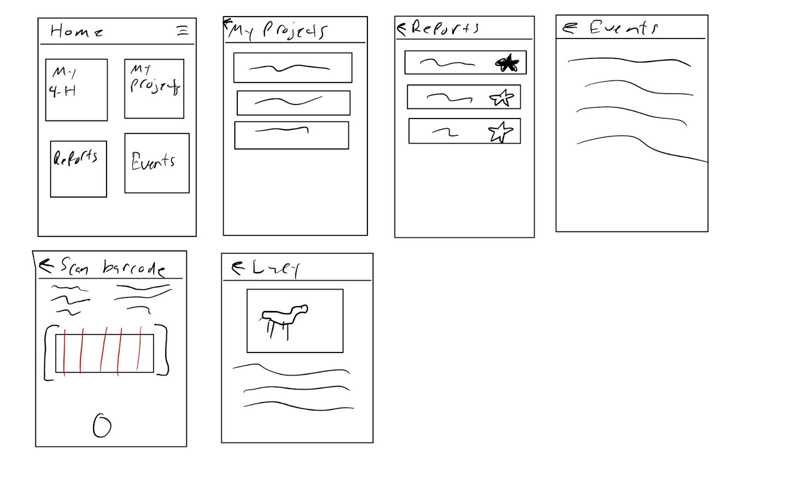
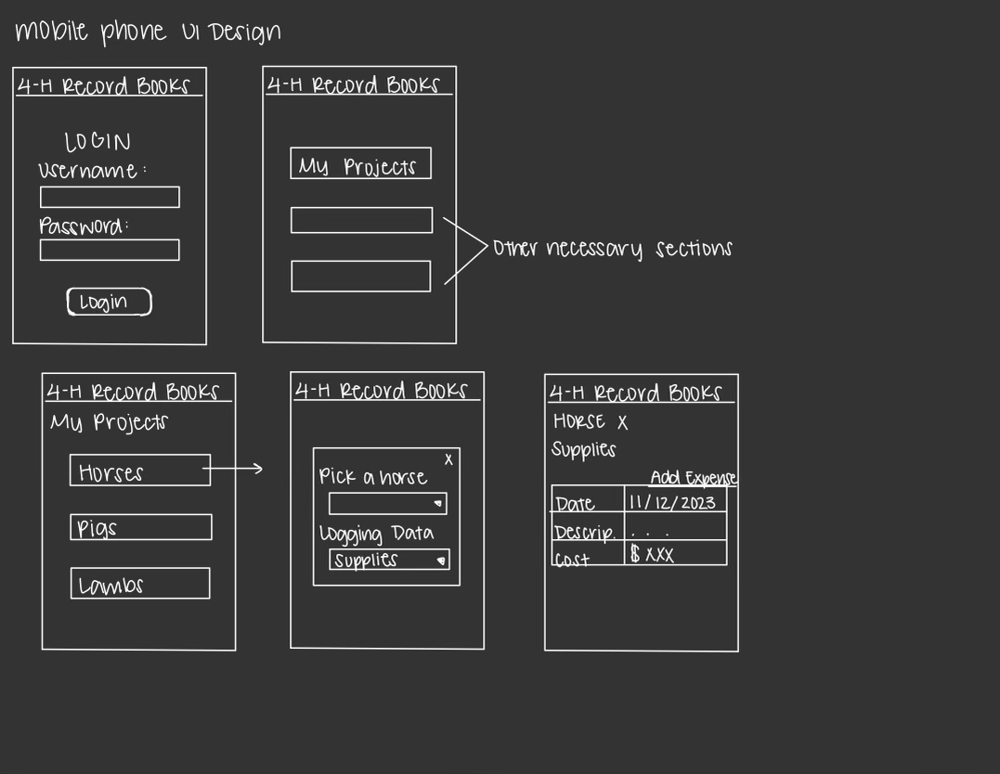
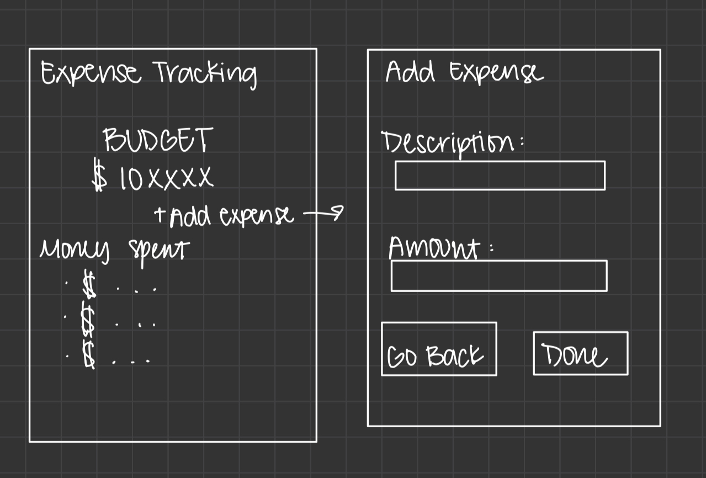

# Product Requirements Document
Last Updated: 2/27/2024

## Product Description
Youth in 4-H have an old and inefficient tracking system for tracking the progress of their 4-H projects. The current process involves youth printing and manually filling out report books, some of which are almost 50 years old. While some forms have been made into fillable PDFs, formatting causes problems when trying to import them into Word. The current system is difficult to manage and can often lead to losses of records and valuable project information. 

## Scope
The primary scope of this product is to allow youth to track the progress of their project and to generate reports requested by a youth automatically. The list of supported reports will primarily focus on the 4-H résumé and the General Animal Science record books. Stretch goals for this product are to also include automatic report generation for the other project areas which include but are not limited to: livestock records, STEM records, horticulture records, and expressive art records.

## Use Cases
- Users will log purchases made for their project. The user will download a budget report to see all purchases made for the project. 
- Users will track projects over time to build up a resume. Users will download and print resumes to show off skills they have learned and to report project histories. 
- Users will log volunteer hours and divide the hours into proper categories. The users will see these logged hours in the proper table on the resume. 

## Purpose and Vision (Background)
Our purpose is to develop a reporting platform that allows users to track the progress of their projects and items for their 4-H Resume. The product will allow users to export their logged data and create automatically formatted reports at any given time. Items for the 4-H Resume that can be logged are hours and experiences for things like volunteer hours, leadership hours, and club involvement. The end goal of this product would be to develop a platform that works for any 4-H project, regardless of project type.

Our vision is to aid 4-H youth in learning life skills by providing tools to better manage their projects, resources, and reports.

## Stakeholders
The following section outlines the parties who hold a stake in the project and its success.
### OSU Capstone Team
The OSU Capstone team oversees the product’s day-to-day and technical decisions. They are in charge of informing other stakeholders of the project status and convening meetings with the other stockholders if a significant functional change is required for the project to continue.

### Project Partner
The project partner is responsible for representing the 4-H organization and informing the capstone team of the primary functions of the product. The project partner must be informed if any primary functionality requirements need to be altered or removed. Project partners are to be updated when significant milestones have been reached, or an update request has been made.

### 4-H Legal Representatives
4-H is responsible for providing legal counsel for any topics which may require legal representation. Topics include, but are not limited to: usage of user data, use of 4-H assets, and protection of youth privacy.

### 4-H Youth
Although youth are not considered decision-makers for this project, they are the primary users of the product and, therefore, have a stake in its success.

## Preliminary Context
### Assumptions
- A web app that works across all browsers (iOS, Android, Windows, macOS, Linux) and is responsive to size can be developed.
- Libraries/APIs used for database access and report generation are up-to-date, tested, and functioning.
- Users will have a device that is capable of running a supported web browser and is connected to the internet.
- We have two months to provide proof-of-concept for core functionality and 7 months to complete a functional product. 
- 4-H IT understands legal requirements to hold data for minors.
- 4-H will either supply or have funding for services such as, but not limited to, web hosting, database housing, and media storage.

### Constraints
- The capstone team only consists of 3 members who are also busy with other obligations. Time should be budgeted and allocated efficiently to take advantage of the development process.
- The project partner is not fluent in technical software skills.
- Knowledge of React and NextJS is limited at the beginning of the project.
- Infrastructure will need to be set up and maintained to host the site and application database. 
- The application will need to adhere to standards that govern and protect the data of minors.

### Dependencies
- The application is dependent on having a reliable library to generate reports. 
- The project depends on meeting security requirements for collecting and using minors' data.
- We depend on infrastructure that reliably hosts the application and the database, and makes the application accessible from different networks.

## Market Assessment and Competition Analysis
### 4-H Livestock Record
This application is made by the NM State University Learning Games Lab, and it helps keep a record of 4-H livestock projects. This application can be used as an example of how a project can be tracked digitally, but it has server issues that do not make it a valid option.
- The application is no longer being maintained and stopped updates in 2020.
- The application only focuses on livestock projects and does not allow tracking of other projects. 
- The application does not automatically generate PDF reports.
- It is a native app, so it can’t be accessed through a web browser.

This appears to be the only application available, but it was recommended at the time as the go-to app. This app can be a baseline of what we should be focusing on for this project.

## Target Demographics (User Persona)
### Persona 1 (Youth)
|  | Description |  | Biography |
|------ | --------| ------ | --------|
| **Persona Name** | Eddie Joel | **Professional goals** | Eddie would like to teach agriculture to high school students. |
| **Persona Role** | 4-H Youth | **Motivators** | Eddie has been heavily impacted by his teachers at school, and he wants to do the same with other kids.  |
| **Age** | 15 | **Challenges** | Eddie has a lot of work to do on the farm, so sometimes he gets behind in HW. |
| **Gender** | Male | **Sources of information** | Eddie uses online resources for most of his research. |
| **Education** | In High School | **Lifestyle** | Eddie lives with his parents and uses the school bus to get to school. |
| **Income** | N/A | **Personal interests** | Eddie enjoys working with lambs and he also enjoys fishing. |
| **Residence** | Rural | **Values** | Eddie is a realist. |
| **Personal Quote** | “Working on my 4-H projects has taught me a lot about how to manage finances and present in front of people.” | **Attitudes** | Eddie is cautious and committed to what he puts his mind to. |

## Requirements
### User Stories and Features (Functional Requirements)
#### 4-H Resume
- As a youth, I should be able to log 4-H Club Involvement, so that it shows up in my 4-H Resume.
- As a youth, I should be able to log 4-H Projects, so that it shows up in my 4-H Resume.
- As a youth, I should be able to log Event/Activity Participation, so that it shows up in my 4-H Resume.
- As a youth, I should be able to log Leadership Roles, so that it shows up in my 4-H Resume.
- As a youth, I should be able to log Community Service, so that it shows up in my 4-H Resume.
- As a youth, I should be able to log Communications, so that it shows up in my 4-H Resume.
- As a youth, I should be able to log Contests/Competitions, so that it shows up in my 4-H Resume.
- As a youth, I should be able to log Recognitions, so that it shows up in my 4-H Resume.
- As a youth, I should be able to print an automatically generated 4-H Resume, so I can hand it in during fair.
- As a youth, I should be able to log into my individual youth account, so that I can access my individual information.

#### General Animal Science Record
- As a youth, I should be able to log my Animal Inventory, so that it shows up in my 4-H project.
- As a youth, I should be able to log my Equipment Inventory, so that it shows up in my 4-H project.
- As a youth, I should be able to log my Supplies Inventory, so that it shows up in my 4-H project.
- As a youth, I should be able to log my Feed Inventory, so that it shows up in my 4-H project.
- As a youth, I should be able to log Expenses, so that it shows up in my 4-H project.
- As a youth, I should be able to log data about what is being fed to my animals, so that it shows up in my 4-H project.
- As a youth, I should be able to log Income, so that it shows up in my 4-H project.
- As a youth, I should be able to log my Financial Summary, so that it shows up in my 4-H project.
- As a youth, I should be able to print an automatically generated 4-H Animal Science Record, so that I can hand it in during fair.
- As a youth I should be able to log into my individual youth account, so that I can access information about my project.

| User Story | Feature | Priority | GitHub Issue | Dependencies |
| ------ | ------ | ------ | ------ | ------ |
| As a youth, I should be able to log 4-H Club Involvement, so that it shows up in my 4-H Resume. | 4-H Resume Reporting | High | N/A | Logging and Automatic Report Generation |
| As a youth, I should be able to log 4-H Projects, so that it shows up in my 4-H Resume. | 4-H Resume Reporting | High | N/A | Logging and Automatic Report Generation |
| As a youth, I should be able to log Event/Activity Participation, so that it shows up in my 4-H Resume. | 4-H Resume Reporting | High | N/A | Logging and Automatic Report Generation |
| As a youth, I should be able to log Leadership Roles, so that it shows up in my 4-H Resume. | 4-H Resume Reporting | High | N/A | Logging and Automatic Report Generation |
| As a youth, I should be able to log Community Service, so that it shows up in my 4-H Resume. | 4-H Resume Reporting | High | N/A | Logging and Automatic Report Generation |
| As a youth, I should be able to log Communications, so that it shows up in my 4-H Resume. | 4-H Resume Reporting | High | N/A | Logging and Automatic Report Generation |
| As a youth, I should be able to log Contests/Competitions, so that it shows up in my 4-H Resume. | 4-H Resume Reporting | High | N/A | Logging and Automatic Report Generation |
| As a youth, I should be able to log Recognitions, so that it shows up in my 4-H Resume. | 4-H Resume Reporting | High | N/A | Logging and Automatic Report Generation |
| As a youth, I should be able to print an automatically generated 4-H Resume, so I can hand it in during fair. | 4-H Resume Reporting | High | N/A | Logging and Automatic Report Generation |
| As a youth, I should be able to log into my individual youth account, so that I can access my individual information. | User Profile | High | N/A | Authentication and User services |
| As a youth, I should be able to log my Animal Inventory, so that it shows up in my 4-H project. | Animal Science Reporting | High | N/A | Logging and Automatic Report Generation |
| As a youth, I should be able to log my Equipment Inventory, so that it shows up in my 4-H project. | Animal Science Reporting | High | N/A | Logging and Automatic Report Generation |
| As a youth, I should be able to log my Supplies Inventory, so that it shows up in my 4-H project. | Animal Science Reporting | High | N/A | Logging and Automatic Report Generation |
| As a youth, I should be able to log my Feed Inventory, so that it shows up in my 4-H project. | Animal Science Reporting | High | N/A | Logging and Automatic Report Generation |
| As a youth, I should be able to log Expenses, so that it shows up in my 4-H project. | Animal Science Reporting | High | N/A | Logging and Automatic Report Generation |
| As a youth, I should be able to log data about what is being fed to my animals, so that it shows up in my 4-H project. | Animal Science Reporting | High | N/A | Logging and Automatic Report Generation |
| As a youth, I should be able to log Income, so that it shows up in my 4-H project. | Animal Science Reporting | High | N/A | Logging and Automatic Report Generation |
| As a youth, I should be able to log my Financial Summary, so that it shows up in my 4-H project. | Animal Science Reporting | High | N/A | Logging and Automatic Report Generation |
| As a youth, I should be able to print an automatically generated 4-H Animal Science Record, so that I can hand it in during fair. | Animal Science Reporting | High | N/A | Logging and Automatic Report Generation |
| As a youth I should be able to log into my individual youth account, so that I can access information about my project. | User Profile | High | N/A | Authentication and User Services |

### Non-Functional Requirements
- Product should work on mobile and PC web browsers.
- Web components used should ensure compatibility with major web browsers.
- The app should be available to access 24/7, except during scheduled maintenance windows.
- The product must comply with The Children's Online Privacy Protection Act (COPPA).
- Code should be self-documenting.
- The product should have online documentation.
- Record read/writes to the database should be inexpensive/reasonable.
- The product should support large numbers of users at one time. 
- Initial app should load within 4 seconds of entering, given reasonable bandwidth.
- The app must provide a responsive user experience, ensuring that actions like data entry and report generation take no longer than 2 seconds to complete.
- The app must take users with disabilities into consideration.

### Data Requirements
| Youth Information |
| ------ |
| <ul><li>First name<li>Last name<li>Birthday<li>4-H association<li>Gender<li>Project List<li>Email<li>Phone number<li>Parent contact information </ul> |

| Project | Livestock | Product Purchase |
| ------ | ------ | ------ |
| <ul><li>Associated youth<li>Project type</ul>| <ul><li>Associated project<li>Animal type<li>Name<li>Photo </ul>| <ul><li>Associated project<li>Product name<li>Product UPC<li>Quantity<li>Cost<li>Purchase type </ul>|

### Integration Requirements
- An API will be used to connect to the MongoDB database.
- The React-PDF library will be used to generate the automatic reports.
- An API (such as BarcodeLookup) will be used to scan barcodes for products.

### User Interaction and Design

## Milestones and Timeline
### Fall Term
- Project research/documentation (3 weeks)
- Setup project workspace (1 week)
- Learn React/NextJS (3 weeks)
- Create local database/backend APIs (2 week)
- Create logging app prototype (3 weeks)
    - Requires React/NextJS knowledge and backend API
    - Prototype basic auto generating report

### Winter Term
- Convert report to required template docs (3 weeks)
- Finish app UI (5 weeks)
- Finish auto report generation
    - Templates must be converted
- Start alpha/beta testing (2 weeks)
    - App UI is finished and so is auto report generation

### Spring Term
- Beta/final testing (2 weeks)
- Complete product (3 weeks)
- Finish product documentation (3 weeks)
- Create public documentation (1 week)
- OSU Project fair prep/present (2 weeks)

## Goals and Success Metrics
| Goal | Metric | Baseline | Target | Tracking Method |
| ------ | ------ | ------ | ------ | ------ |
| Resource Efficient UI | Average session load time | TBD | < 1 second | App metrics |
| Application users | Number of users in the last 30 days | TBD | > 1000 monthly users | App metrics |
| Timely reporting | Average time to produce a report | TBD | < 3 seconds | App metrics |
| Streamline Project Management for 4-H Students | Average time saved by students using the app | TBD | 20% reduction | Analytics and Surveys |

## Open Questions
- Where is the application database going to be stored?
- Should the auto-generated reports have the same look as the current reports?
- How will we ensure that the database contains accurate and up-to-date data?
- What measures will be taken to secure sensitive user data, especially considering child users?
- What strategies will be employed to ensure that the app is easily accessible on both mobile and computer platforms?

## Out of Scope
- Reports that are not for the resume or general animal sciences may not be converted due to time constraints.
- Non-animal science projects may not be supported due to time constraints.
- The app will not be downloadable from App Stores.
