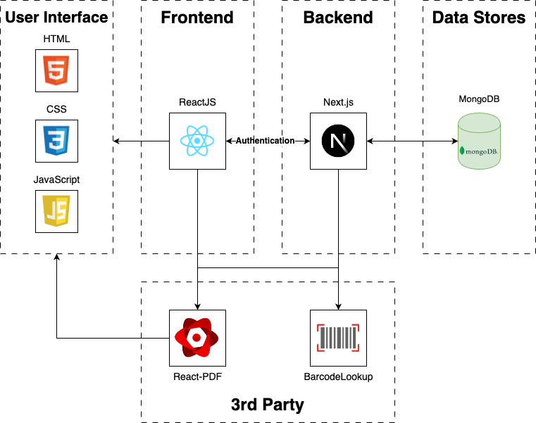

# Software Design and Architecture
Last Updated: 12/3/2023

## Introduction
The following document outlines the architecture for the 4-H Record Books application; a web-based project management application designed to aid 4-H youth in the tracking and reporting of project information. The purpose of a well-defined architecture is to ensure the scalability, maintainability, reliability, and safety of the system and its users. The architecture presented aligns with federally-mandated and 4-H youth protection guidelines.

## Architectural Goals and Principles
### Security
The 4-H Record Books project management application is meant to aid 4-H Youth in tracking previous and ongoing projects to record historical data and automatically format reports. As this application is working directly with underage youth, data privacy is of the utmost importance. The application must adhere to regulations and guidelines for youth privacy, such as those outlined in the Children’s Online Privacy Protection Act (COPPA), and others like it. Part of the responsibility of developers is to design a system that only collects the required information and stores it in safe/approved ways.

### Scalability
The Record Books application is designed to focus on the 4-H résumé and general animal science projects. However, it should be able to scale up to include other types of 4-H projects. The architecture should be modular, so very little of the project code is specific to any given project. The design should also be able to sustain a large number of users, and should be able to scale up if necessary. 

### Data
Data collected and this application should adhere to the following standards: only required data is collected, data is separated and is only visible to concerned parties, and should follow standard relational database guidelines.

## System Overview

## Architectural Patterns
Record Books mainly takes on the model-view-controller (MVC) and client-server architectures, with most of the work being completed client-side. The view is the React-generated UI presented to the user. The model is the backend server that handles data requests, HTTP requests, authentication, and heavy lifting that can’t be done client side. The controller is the frontend client code that does input validation and report processing. React web apps put a lot of the workload on the client web browser. The client handles page processing, input validation, and view creation. The view and controller are both client-side and the model is server-side. 

## Component Descriptions
### User Interface
The user interface is one of the most essential parts of any mobile application. The user interface is responsible for displaying content to the user and providing interaction points for the user to manipulate the app’s state. The user interface should provide a straightforward understanding of how the user should interact and navigate within the app. The user interface is created using ReactJS.

### Backend Server
The backend server has the responsibility of processing application requests, handling business logic, and interfacing with the database and/or front end. The backend server is also responsible for implementing security measures to protect data from unauthorized access and limiting the visibility of data to users (separation of concerns). The backend server is created using Next.js.

### Database
The database is responsible for the storing of user and application data. It is built with a relational schema, and an API is provided to complete CRUD operations.

### 3rd Party
Third-party modules, such as barcode lookup and react-PDF, are crucial to the success of this product. The barcode lookup API allows users to scan product barcodes to record purchased products. The react-PDF API is what creates the automatic reports, which is one of the Center features of this product. 3rd party modules are responsible for alleviating the amount of custom code needed for the application.

## Data Management
The database will use a rational structure that can connect entities such as youth, mentors, projects, purchases, events, etc. A REST API will be created to facilitate CRUD operations for user and application data. The application database should maintain at least normalization form (NF) level 2, striving for NF3 if possible and seen as appropriate.

## Interface Design
### Projects
- GET
    - /project/{projectID} - Get details for a singular project.
    - /projects/{youthID} - Get a list of all projects associated with a youth.
- POST /project - Create new project.
- PUT /project/{projectID} - Update an existing project.
- DELETE /project/{projectID} - Remove project from database.

### Expenses
- GET
    - /expense/{expenseID} - Get details for a singular expense.
    - /expenses/{youthID} - Get a list of all expenses associated with a youth.
    - /expenses/{projectID} - Get a list of all expenses associated with a youth.
- POST /expense - Create new expense.
- PUT /expense/{projectID} - Update an existing expense.
- DELETE /expense/{projectID} - Remove expense from database.

### Standard Log Template
This template is used as a general standard for working with logs such as vaccinations, feeding, or any other basic transactional data.. 
- GET /logTypes/{projectID} - Get a list of all records of logType associated with a project.
- POST /logType - Create new log of type logTypes.
- PUT /logType/{logID} - Update an existing expense.
- DELETE /logType/{logID} - Remove expense from database.

## Considerations
### Security
One of the biggest considered security concerns for the Record Books Application is the leaking or misuse of Youth information. The application targets users that are branching from ages 9-18, which majority of this bracket falls under the category of being a minor. To combat potential security leaks, the following will be implemented, for all types of users. 
- **Authentication:** The project will first require authentication of a user. Examples of authentication can be phone number, email/password, and logging in with Google. 
- **Limited Visibility:** Once authenticated, users will only have the availability to view projects they are tagged in. For students, this means they are only able to see projects that they have created. For mentors, they can only view projects in which they have been assigned to, and they can only see the students assigned to those particular projects. The only stretch to this rule, should such a feature be created, would be students can see other students and mentors who are associated with the same club.
- **Data Transmission:** The application shall force the use of HTTPS and use SSL/TLS for secure data transmissions between the application and the database.
Web Application Attacks: The application needs to be able to combat security threats such as SQL injection, insecure direct object references, URL restriction failures, etc. To do this, the application shall minimize the amount of customizable and dynamic user inputs, run input validation, use generic identifiers when possible, and check authorization/source of incoming information/requests.

### Performance
- **Bandwidth:** Speeds for this application is a concern due to where the target audience may be located. It is known that users, specifically in the animal science projects, may be locations with little phone service. This means we will be required to attempt to use bandwidth responsibly. One way we can do this is to cache values we know will not change frequently. An example of this can be the project overview section. For quartering the database for reports, we should be intentional about not returning any information that is not required. That way the package sizes are smaller when being sent to users.
- **Media:** Large media files are expensive to both store and send to users. Application resources should be minified and optimized and user upload media should be compressed when possible.
- **Resource Management:** Automatic resource management should be implemented to help manage server loads. Load balancers can be used to direct traffic during peak usage hours and optimizations to request/query calls can be made to minimize physical time on a server. If the above methods are not sufficient for creating an optimized application, the server resources should be scaled horizontally to add more nodes to the resource chain. Scaling out/horizontally will allow the system to handle a larger amount of requests at one time instead of trying to just get requests done faster through scaling vertically.

### Maintenance and Support
As of the current time, 4-H does not have anyone they are planning to designate to maintain the project once it is turned over by the capstone team. To be able to maintain this project, 4-H will need to be able to find someone who either knows (or can learn) ReactJS/NextJS, HTML/CSS/JavaScript, SQL, and basic cloud hosting. Potential options for 4-H to continue developing and maintaining the application can be to designate their own resources, hire one of the capstone team members, resubmit the capstone project, or hire another party. To ensure this transition is smooth and knowledge is transferred over, the capstone team will properly document database structures, code, and keep project documents up-to-date.

## Deployment Strategy
### Local
For local deployment, developers will use the resources they have available on their local machine via a local server to test product features. A demo database can be hosted on the local machine or connected to a student database offered by the school. Once the application database is created, this too can be used.

### Staging
Staging deployment should mimic production deployment or be close to it. Staging can be done through a hosting platform like GitHub pages or Render. The staging platform should use a live database connection if available.

### Production
The production service has not yet been decided. Possible services include AWS, Firebase, Render, GitHub Pages, etc. Size is also yet to be determined. A meeting with the project partner to cover realistically how many users there is required.

## Testing Strategy
### Local

A local set of unit tests and feature tests should be run on the local machine to test basic functinality and find bugs.

### Staging
Tests during staging should be unit tests to test specific baseline features, regression tests on the incoming code changes, integration tests, and application bugs tests. Staging should mimic the production environment for best results. Performing the above tests should eliminate uncertainties between the local and online environments.

### Production
By the time code makes it to production, the primary production test should be focused on security and performance. Performance testing should test both server side and client side code. Client side code should test for length of time to receive query results, page load time, incoming package sizes, etc. Server side tests should include load management during peak hours, average number of requests within certain time frames, database read and write requests, time per incoming request, etc. For security management, we should have an outside party test the application to find security voter abilities. Examples of white hat hackers can be hired hackers, OSU cyber security club, or another party.

## Glossary
| Acronym | Definition |
| --- | --- |
| API | Application Programming Interface|
| CRUD | Create, Read, Update, Delete |
| REST | Representational State Transfer |
| HTTPS | Hypertext Transfer Protocol Secure |
| SSL | Secure Sockets Layer | 
| TLS | Transport Layer Security | 
| URL | Uniform Resource Locator |

